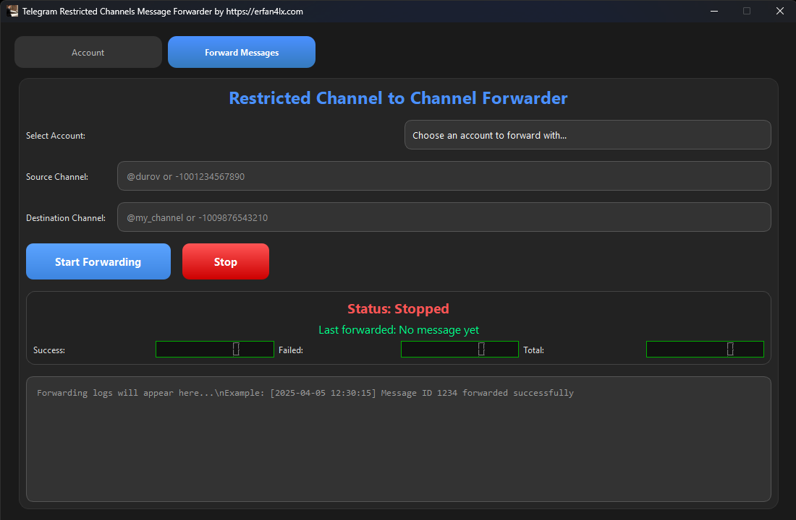

# Telegram-Restricted-Channels-Message-Forwarder
A free GUI tool to save and forward posts from Telegram channels which made their content restricted.

---

## ✨ Features
- Accounts login & management
- Forward messages from any restricted content channel
- Forward by channel username / link / channel id
- Live status & logs UI

# 🚀 How to Use
```bash
pip install -r requirements.txt
python main.py
```

## 📦 Requirements
- Python 3.10+
- Windows 10/11 — Linux/Mac

## 📸 Preview 

---

## 💬 **Connect With Me**

👉 **Telegram:** [**https://t.me/jai_shrihanuman_ji**](https://t.me/jai_shrihanuman_ji)

🌐 **Website:** [**https://cybersecurityworked.blogspot.com**](https://cybersecurityworked.blogspot.com) 

---

🆔My YouTube Channel : https://youtube.com/@mohitexploits

🆔My Telegram Channel : https://t.me/jai_shrihanuman_ji

⚠️ *Important Disclaimer*
This project and video are for **educational, research, and administrative purposes only**.  
It *does not* provide or encourage any method to bypass Telegram privacy settings or access hidden data.  
Any misuse that violates Telegram’s *Terms of Service* or local laws is strictly prohibited.  

Always use anonymized/test datasets or data you have *explicit consent* to process.

<p align="center">
  Follow Me On
</p>
<p align="center">
  <a href=" https://youtube.com/@mohitexploits">
    
  </a>
</p>
